

   <h3 align="center">GScomp-QA: A Subjective Dataset for Quality Assessment of Compressed Gaussian Splatting</h3>
    

   Pedro Martin, António Rodrigues, João Ascenso, Maria Paula Queluz

   Instituto de Telecomunicações, Instituto Superior Técnico, University of Lisbon
    

  

   
     
  

GScomp-QA is a subjective quality assessment dataset designed to evaluate the perceptual impact of compression on Gaussian Splatting (GS) view synthesis. It provides a controlled benchmarking framework in which compression-induced distortions are isolated from artifacts inherent to the synthesis process. This is achieved by using videos rendered from both compressed and uncompressed GS models, enabling direct and consistent perceptual comparisons.

GScomp-QA is designed to support three main objectives:

+ Benchmarking GS compression methods under consistent perceptual criteria
+ Enabling the development and validation of objective quality metrics
+ Providing insights into the perceptual behavior of different GS compression strategies

The dataset comprises **331 video stimuli** generated from **13 real-world scenes**, covering **9 state-of-the-art GS compression solutions**, different quality levels, and two baseline representations (**3DGS** and **Scaffold-GS**). Each stimulus has been evaluated through a controlled subjective study with human observers, resulting in reliable perceptual quality scores.

Beyond subjective evaluation, GScomp-QA also supports the analysis of objective quality metrics. The dataset includes a comprehensive benchmarking of **18 metrics** against the collected subjective scores, providing insights into their effectiveness and limitations in capturing distortions specific to compressed GS view synthesis.

## Dataset Contents

GScomp-QA provides all the necessary data to reproduce the experiments, benchmark compression solutions, and evaluate objective quality metrics. The dataset is organized into several components, each targeting a specific aspect of GS compression and quality assessment:

+ [**Stimuli:**](https://github.com/pedrogcmartin/GScomp-QA/tree/main/stimuli) Contains all generated video sequences used in the subjective study, including both reference (uncompressed) and compressed GS renderings.

+ [**Compression Settings:**](https://github.com/pedrogcmartin/GScomp-QA/blob/main/settings.xlsx) Provides the parameters used for each GS compression solution, for every scene and quality level (HQ, MQ, LQ).

+ [**Subjective Scores:**](https://github.com/pedrogcmartin/GScomp-QA/blob/main/dmos.xlsx) Includes the Differential Mean Opinion Scores (DMOS) obtained from the subjective study, representing the perceived quality of each stimulus.

+ [**Objective Metrics:**](https://github.com/pedrogcmartin/GScomp-QA/blob/main/metrics.xlsx) Contains the scores of 18 objective quality metrics computed for all stimuli.

+ [**Correlation Results:**](https://github.com/pedrogcmartin/GScomp-QA/blob/main/correlations.xlsx) Reports the correlation coefficients (PLCC, SROCC, RMSE, PWRC) between objective metrics and subjective scores.

+ [**Non-Inferiority Test:**](https://github.com/pedrogcmartin/GScomp-QA/blob/main/non_inferiority_test.xlsx) Provides the statistical analysis results identifying cases where the compressed sequence quality is not perceptually inferior to the reference.

## Rate-Distortion Performances

The rate-distortion (RD) performance plots allows for the benchmarking of the evaluated GS compression solutions across all visual scenes. The RD curves illustrate the trade-off between bitstream size (in megabytes or MB) and perceptual quality (DMOS), enabling a direct comparison of compression efficiency under different scene characteristics and representations.

**Tanks and Temples**

 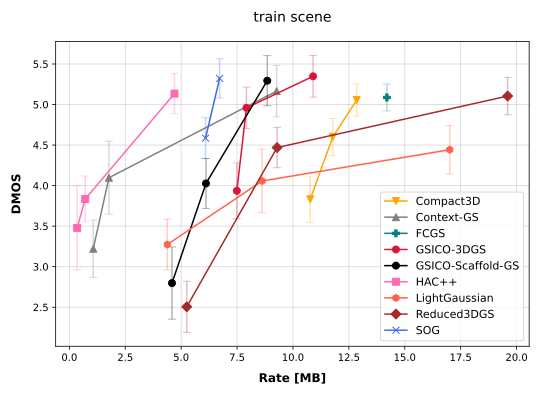 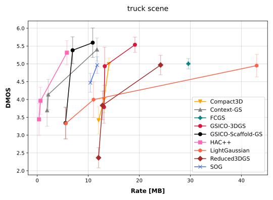 

**Deep Blending**

 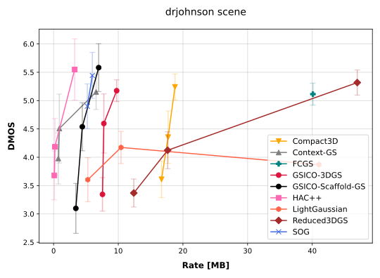 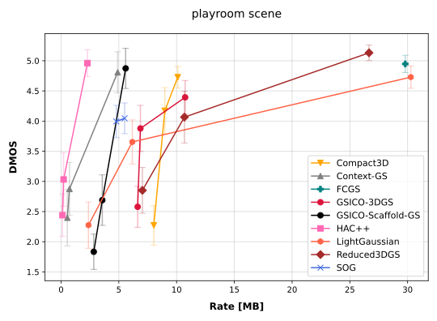 

**Mip-NeRF360 (Indoor)**

 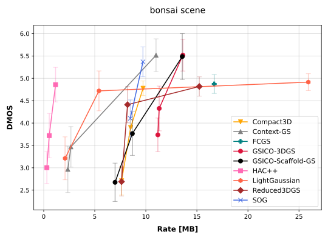 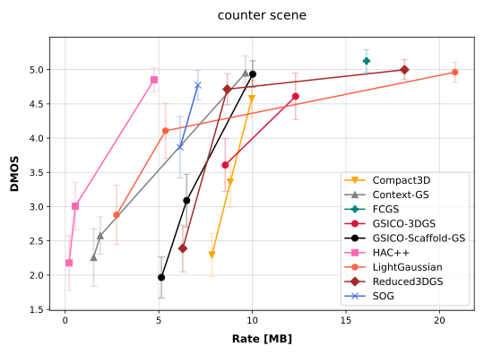 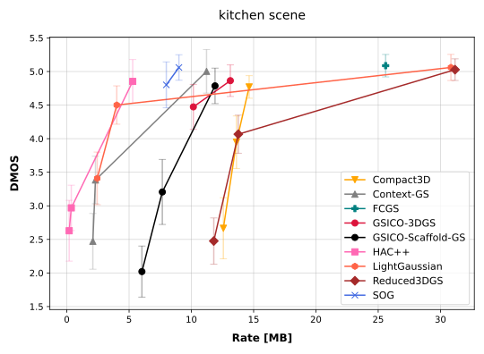 

**Mip-NeRF360 (Outdoor)**

 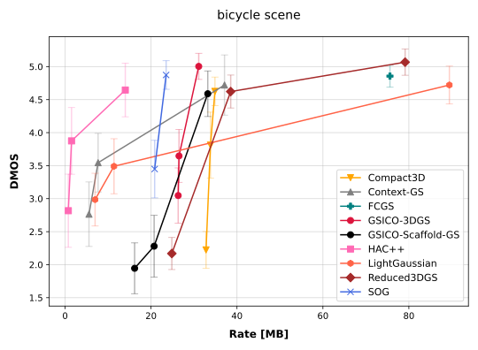 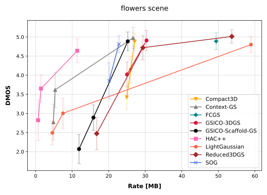 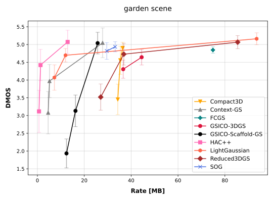 

**Light Field (LF)**

 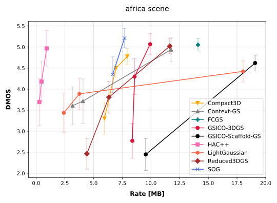 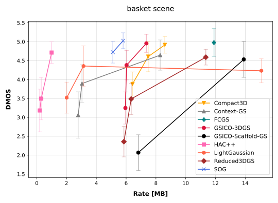 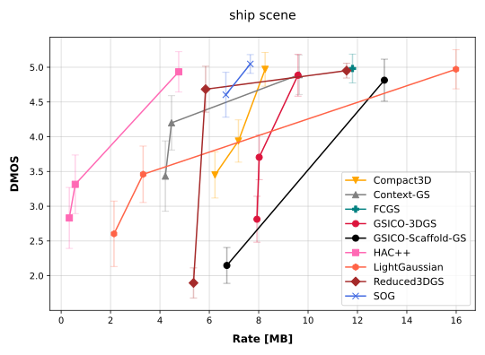 
