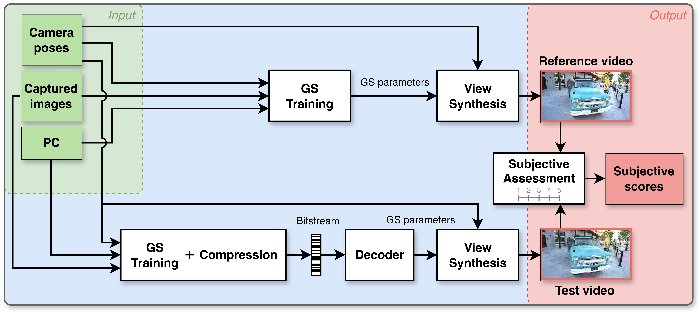

   <h3 align="center">GScomp-QA: A Subjective Dataset for Quality Assessment of Compressed Gaussian Splatting</h3>
    

   Pedro Martin, António Rodrigues, João Ascenso, Maria Paula Queluz

   Instituto de Telecomunicações, Instituto Superior Técnico, University of Lisbon
    

  

   
     
  

GScomp-QA is a subjective quality assessment dataset designed to evaluate the perceptual impact of compression on Gaussian Splatting (GS) view synthesis. It provides a controlled benchmarking framework in which compression-induced distortions are isolated from artifacts inherent to the synthesis process. This is achieved by using videos rendered from both compressed and uncompressed GS models, enabling direct and consistent perceptual comparisons.

GScomp-QA is designed to support three main objectives:

+ Benchmarking GS compression methods under consistent perceptual criteria
+ Enabling the development and validation of objective quality metrics
+ Providing insights into the perceptual behavior of different GS compression strategies

The dataset comprises **331 video stimuli** generated from **13 real-world scenes**, covering **9 state-of-the-art GS compression solutions**, different quality levels, and two baseline representations (**3DGS** and **Scaffold-GS**). Each stimulus has been evaluated through a controlled subjective study with human observers, resulting in reliable perceptual quality scores.

Beyond subjective evaluation, GScomp-QA also supports the analysis of objective quality metrics. The dataset includes a comprehensive benchmarking of **18 metrics** against the collected subjective scores, providing insights into their effectiveness and limitations in capturing distortions specific to compressed GS view synthesis.

## Qualitative results

Visual comparison across scenes. Columns: GT (reference), baseline models (3DGS/Scaffold-GS), and our codec applied to each baseline. Values under each image show PSNR (in dB) and model size (in megabytes). 